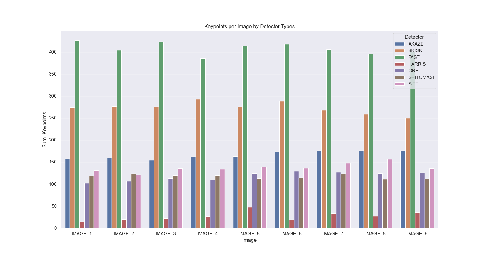
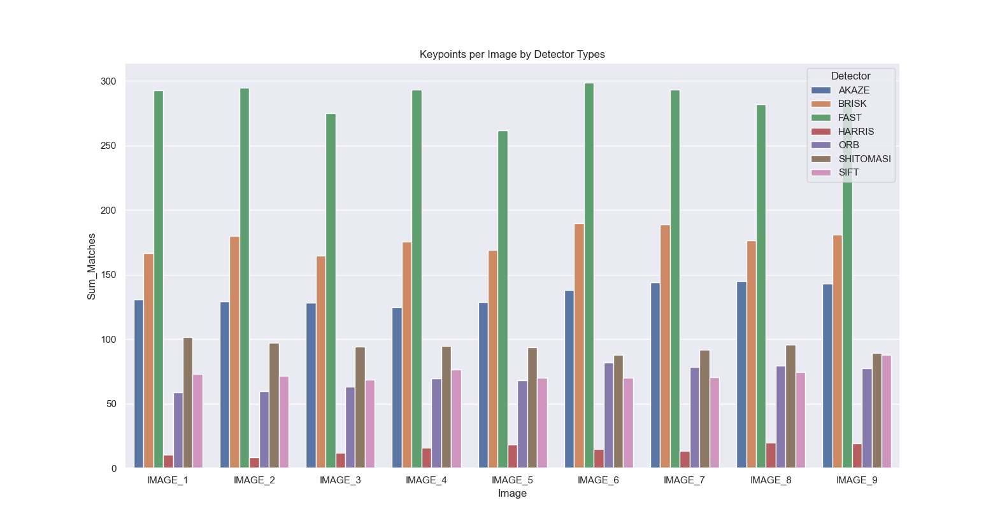
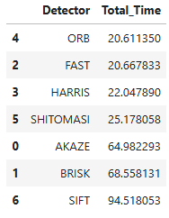
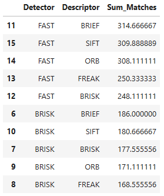

# SFND 2D Feature Tracking


The idea of the camera course is to build a collision detection system - that's the overall goal for the Final Project. As a preparation for this, you will now build the feature tracking part and test various detector / descriptor combinations to see which ones perform best. This mid-term project consists of four parts:

* First, you will focus on loading images, setting up data structures and putting everything into a ring buffer to optimize memory load. 
* Then, you will integrate several keypoint detectors such as HARRIS, FAST, BRISK and SIFT and compare them with regard to number of keypoints and speed. 
* In the next part, you will then focus on descriptor extraction and matching using brute force and also the FLANN approach we discussed in the previous lesson. 
* In the last part, once the code framework is complete, you will test the various algorithms in different combinations and compare them with regard to some performance measures. 

See the classroom instruction and code comments for more details on each of these parts. Once you are finished with this project, the keypoint matching part will be set up and you can proceed to the next lesson, where the focus is on integrating Lidar points and on object detection using deep-learning. 

## Dependencies for Running Locally
1. cmake >= 2.8
 * All OSes: [click here for installation instructions](https://cmake.org/install/)

2. make >= 4.1 (Linux, Mac), 3.81 (Windows)
 * Linux: make is installed by default on most Linux distros
 * Mac: [install Xcode command line tools to get make](https://developer.apple.com/xcode/features/)
 * Windows: [Click here for installation instructions](http://gnuwin32.sourceforge.net/packages/make.htm)

3. OpenCV >= 4.1 & **Installation**
 * All OSes: refer to the [official instructions](https://docs.opencv.org/master/df/d65/tutorial_table_of_content_introduction.html)
 * The OpenCV 4.1.0 source code can be found [here](https://github.com/opencv/opencv/tree/4.1.0)
 * Git clone the following repos: **https://github.com/opencv/opencv.git** and **https://github.com/opencv/opencv_contrib.git**
 * **This must be compiled from source** using the `-D OPENCV_ENABLE_NONFREE=ON` cmake flag for testing the SIFT and SURF detectors. If using [homebrew](https://brew.sh/): `$> brew install --build-from-source opencv` will install required dependencies and compile opencv with the `opencv_contrib` module by default (no need to set `-DOPENCV_ENABLE_NONFREE=ON` manually). 
 * Also make sure top include the option make pc-file -D OPENCV_GENERATE_PKGCONFIG=ON
 * --> **cmake -D CMAKE_BUILD_TYPE=RELEASE -D OPENCV_GENERATE_PKGCONFIG=ON -D OPENCV_ENABLE_NONFREE=ON -D OPENCV_EXTRA_MODULES_PATH=../../opencv_contrib/modules -D WITH_GTK=ON ..**
 * next is to use **make -j$(nproc)** in order to make use of multi processoring
 * then **sudo make install**
 * include hte path to the OpenCV installation: **sudo find / -name opencv4.pc 2>/dev/null** to find the location and then **export PKG_CONFIG_PATH=/path/to/directory:$PKG_CONFIG_PATH** to set it weher /path/to/directory needs to be replaced by the location you found
 * if using the debugger in VS Code please include this in the "args": "`pkg-config",
                                                                        "--cflags",
                                                                        "--libs",
                                                                        "opencv4`"
4. gcc/g++ >= 5.4
  * Linux: gcc / g++ is installed by default on most Linux distros
  * Mac: same deal as make - [install Xcode command line tools](https://developer.apple.com/xcode/features/)
  * Windows: recommend using either [MinGW-w64](http://mingw-w64.org/doku.php/start) or [Microsoft's VCPKG, a C++ package manager](https://docs.microsoft.com/en-us/cpp/build/install-vcpkg?view=msvc-160&tabs=windows). VCPKG maintains its own binary distributions of OpenCV and many other packages. To see what packages are available, type `vcpkg search` at the command prompt. For example, once you've _VCPKG_ installed, you can install _OpenCV 4.1_ with the command:
```bash
c:\vcpkg> vcpkg install opencv4[nonfree,contrib]:x64-windows
```
Then, add *C:\vcpkg\installed\x64-windows\bin* and *C:\vcpkg\installed\x64-windows\debug\bin* to your user's _PATH_ variable. Also, set the _CMake Toolchain File_ to *c:\vcpkg\scripts\buildsystems\vcpkg.cmake*.


## Basic Build Instructions

1. Clone this repo.
2. Make a build directory in the top level directory: `mkdir build && cd build`
3. Compile: `cmake .. && make`
4. Run it: `./2D_feature_tracking`.

## PROJECT TASKS

### MP.1
In order to have a managable size, a data buffer has to be implemented. Please replace the code in section 'TASK MP.1' with an implementation of this principle.

```
// data buffer
int dataBufferSize = 2;       // no. of images which are held in memory (ring buffer) at the same time
vector<DataFrame> dataBuffer; // list of data frames which are held in memory at the same time

// push image into data frame buffer
DataFrame frame;
frame.cameraImg = imgGray;
dataBuffer.push_back(frame);

// limit data frame buffer size by removing oldest frame
if (dataBuffer.size() > dataBufferSize) {
    dataBuffer.erase(dataBuffer.begin());
}
```

### MP.2
There is an existing implementation of the Shi-Tomasi detector. Please implement a selection of alternative detectors, which are HARRIS, FAST, BRISK, ORB, AKAZE, and SIFT.

-> It is possible to select one detector or run at the end all requested detector and descritpot combintions (see flag_all_combinations). In the code the selected detector is a vector of either one or more entries depending on the flag:

```
// Detector Choice:
string detectorType = "HARRIS";      // -> HARRIS, FAST, BRISK, ORB, AKA
    
// Descriptor Choice:
string descriptorType = "BRIEF";    // -> BRIEF, ORB, FREAK, AKAZE, SIFT

// FLAGS
bool flag_all_combinations = true; // to process all above Detector/Descriptor combinations

```

### MP.3
As we are focussing on a collision detection system in this course, keypoints on the preceding vehicle are of special interest to us. Therefore, in order to enable a more targeted evaluation, we want to discard feature points that are not located on the preceding vehicle.

-> the filtering on keypoint only from the proceeding vehicle is done like this:
```
// reduce search to proceeding vehicle box
bool bFocusOnVehicle = true; // focus only on the proceeding vehicle
cv::Rect vehicleRect(535, 180, 180, 150); // fix pixle locations

if (bFocusOnVehicle)
{
    // temp vector to write out the keypoints of interest
    vector<cv::KeyPoint> framedKeypoints;
    for (auto kp : keypoints) {
        if (vehicleRect.contains(kp.pt)) framedKeypoints.push_back(kp);
    }
    // reframed keypoints
    keypoints = framedKeypoints;
}

```

### MP.4
Your fourth task is to implement BRISK, BRIEF, ORB, FREAK, AKAZE and SIFT methods and make them selectable using the string 'descriptorType'.

-> For the seltection pls see. MP.2 and the code snippet. The code od the descriptors is added accordingly in matching2D_Student.cpp

### MP.5
You must now add FLANN as an alternative to brute-force as well as the K-Nearest-Neighbor approach.

-> The code od the descriptors is added accordingly in matching2D_Student.cpp. It has been taken care for the special case that SIFT only works with a different norm in case of Brut Force as well as FLANN. All descritors are using binary implementations.

-> Also the KNN selector type is implemented in which k=2.

### MP.6
Filtering method to remove bad keypoint matches:

```
// Filter matches using descriptor distance ratio test
double minDescDistRatio = 0.8;
for (auto it : knn_matches) {
    // Check if the  2 matches are near to each other % if so psuh to resulting vector
    if ( 2 == it.size() && (it[0].distance < minDescDistRatio * it[1].distance) ) {
        matches.push_back(it[0]);
    }
}
```

### MP.7
Count the number of keypoints on the preceding vehicle for all 10 images.

-> You find a file inside the results folder in which you have the overview on all results.


### MP.8
Count the number of matched keypoints for all 10 images using all possible combinations of detectors and descriptors. In the matching step, use the BF approach with the descriptor distance ratio set to 0.8.



### MP.9
Your ninth task is to log the time it takes for keypoint detection and descriptor extraction. The results must be entered into a spreadsheet and based on this information you will then suggest the TOP3 detector / descriptor combinations as the best choice for our purpose of detecting keypoints on vehicles. 

-> Pls. see the filtering of the data:


Finally, in a short text, please justify your recommendation based on your observations and on the data you collected.

-> Considering we are want to have TTC, 2 main criteria: (a) TIME and (b) HIGH MATCHING: there for I would choose the following combination:

 - Detector Type:   FAST
 - Descriptor Type: BRIEF or ORB

based in the following analysis:





